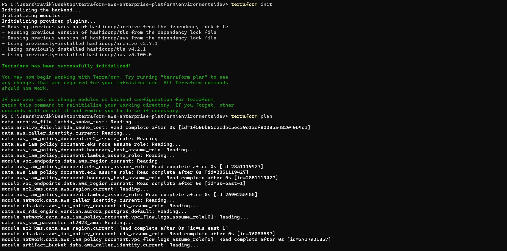
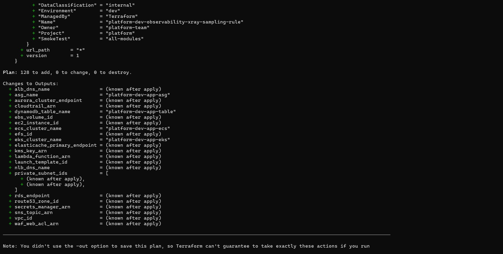

# Terraform AWS Enterprise Platform

[](https://opensource.org/licenses/MIT)
[](https://www.terraform.io/)
[](https://aws.amazon.com/)
[](https://github.com/devopsexpertlearning/terraform-aws-enterprise-platform)

> **Production-ready Terraform repository with reusable modules and separate environment roots.**

## Architecture and Demo





<video src="docs/terraform-video.mp4" controls="controls" muted="muted" style="max-width: 100%;"></video>

## Standard Structure
- `modules/`: reusable infrastructure modules.
- `platform-bootstrap/`: organization and shared services bootstrap.
- `policies/`: policy definitions.
- `environments/dev`, `environments/uat`, `environments/prod`: standalone deployable roots.

Each environment has its own:
- `backend.hcl` (optional, for remote S3 state)
- `versions.tf`
- `providers.tf`
- `variables.tf`
- `main.tf`
- `outputs.tf`
- `terraform.tfvars`

## Deploy an Environment
Example for `dev`:

```bash
terraform -chdir=environments/dev init
terraform -chdir=environments/dev plan -var-file=terraform.tfvars
terraform -chdir=environments/dev apply -var-file=terraform.tfvars
```

## Plan-Only (All Modules in Dev)
`environments/dev` is wired to exercise all modules under `modules/` in a single plan.

1. Update `environments/dev/terraform.tfvars`:
- `ami_id`
- `db_secret_string`
- `route53_zone_name`
- any account-specific ARNs and CIDRs

2. Choose one init mode:
- Local backend (default): `terraform -chdir=environments/dev init`
- Remote backend (optional, later/CI): `terraform -chdir=environments/dev init -backend-config=backend.hcl`

Note: For remote S3 backend, `backend.hcl` uses `use_lockfile = true` and does not require DynamoDB locking.

3. Validate and plan:
- `terraform -chdir=environments/dev validate`
- `terraform -chdir=environments/dev plan -var-file=terraform.tfvars`

## Prerequisites
- Terraform `>= 1.9.0`
- AWS credentials configured for the target account
- AWS permissions to read/create resources used by all integrated modules

## Common Issues
- `No valid credential sources found`: configure AWS credentials/profile before running plan.
- Backend init errors: if using remote backend, verify `environments/<env>/backend.hcl` bucket/key/region values.
- Variable errors: ensure required fields in `terraform.tfvars` are set with valid values.

## Port to Another Account/Region
Change only these files per environment:
- `backend.hcl` (if using remote state: bucket/key/region/lockfile)
- `terraform.tfvars` (region, CIDRs, AMI, instance size, tags, ARNs)
